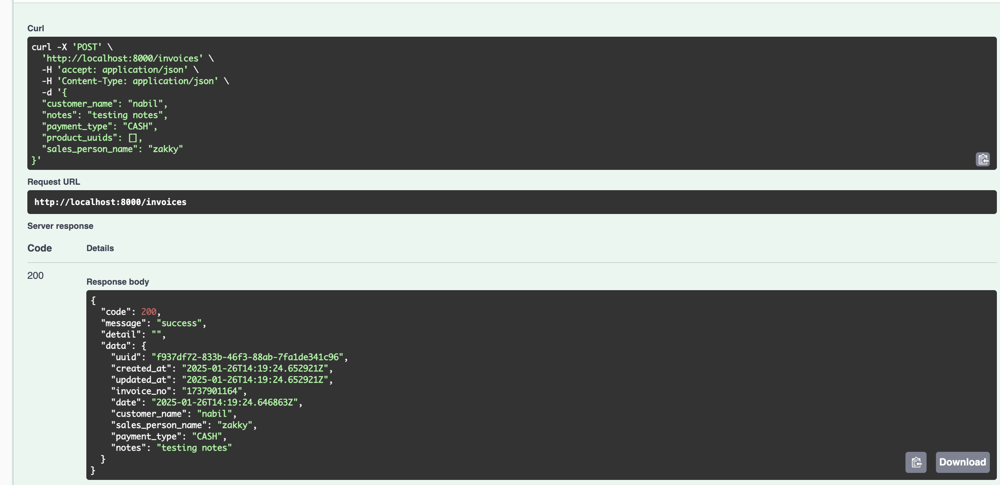
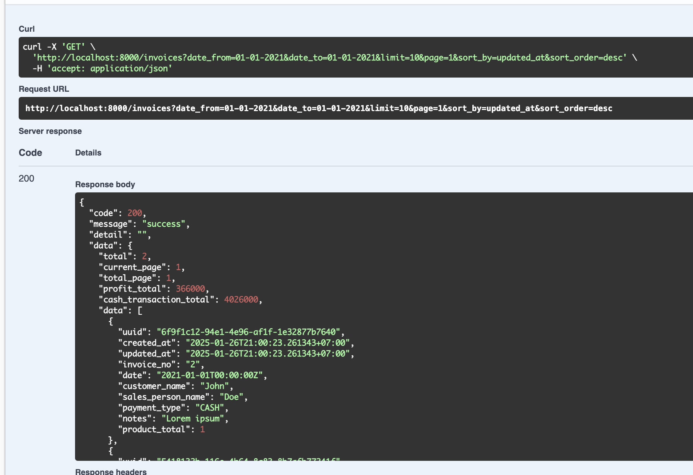
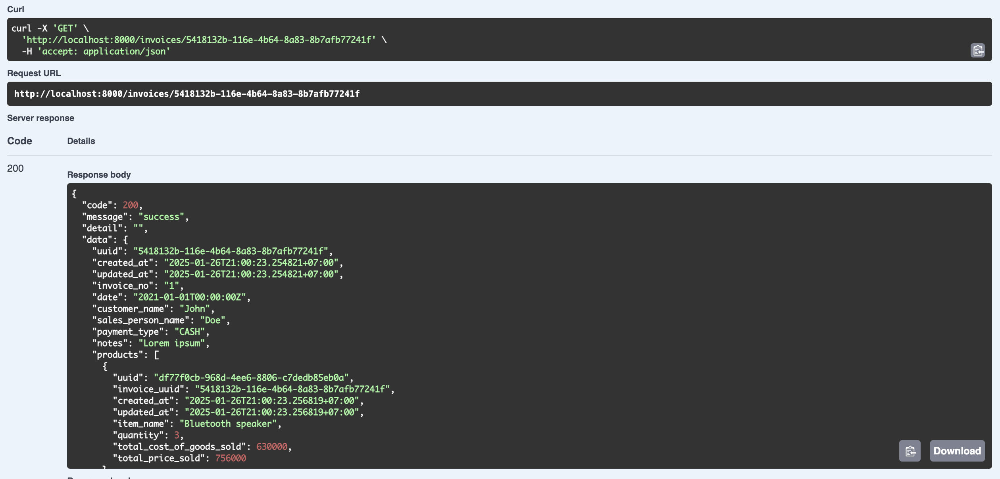
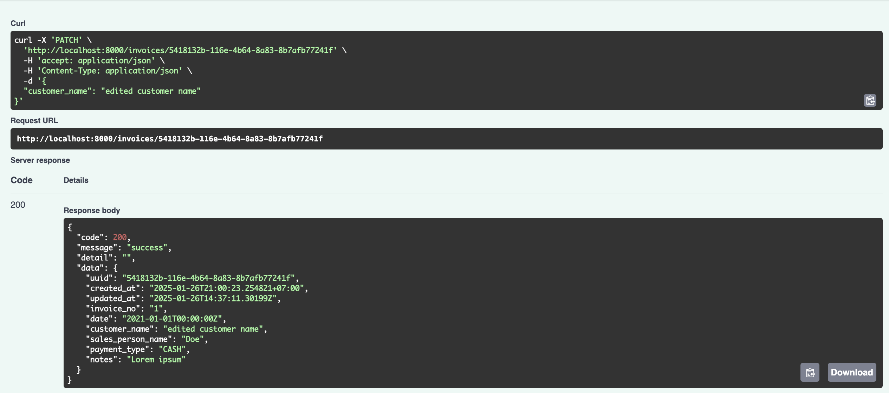
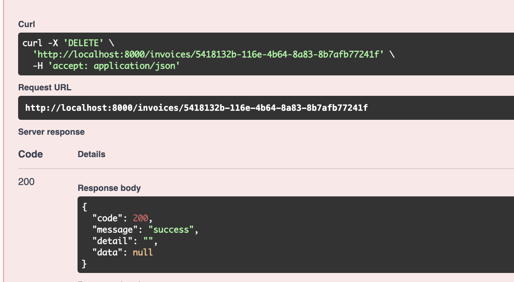
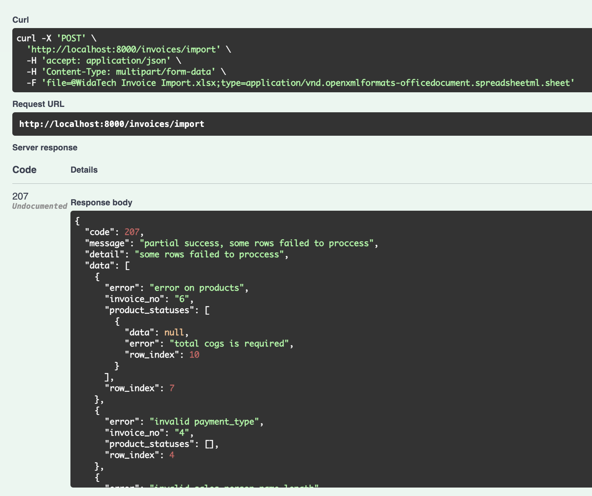

# Widatech Test

## Backend Installation
- Go to directory `./Go`
- Copy `.env.example` to `.env` file and customize it.
- Run docker compose command:
    ```
    sudo docker compose up -d --build
    ```
- Verify installation by accessing `http://localhost:8000/`

## Postman Request Example
Open [./postman_collection.json](./postman_collection.json) file to see request examples.

## Swagger API Documentation
Once the application is deployed, you can access the swagger documentation via [http://localhost:8000](http://localhost:8000) or [http://localhost:8000/swagger/index.html](http://localhost:8000/swagger/index.html)

## Mandatory Features (Section 1 & Section 3)
1. **Create API Request**
    

2. **Read API Request (Get List) **
    

3. **Read API Request (Get Detail)**
    

4. **Update API Request (use patch method)**
    

5. **Delete API Request**
    

6. **Import xlsx File**
    

